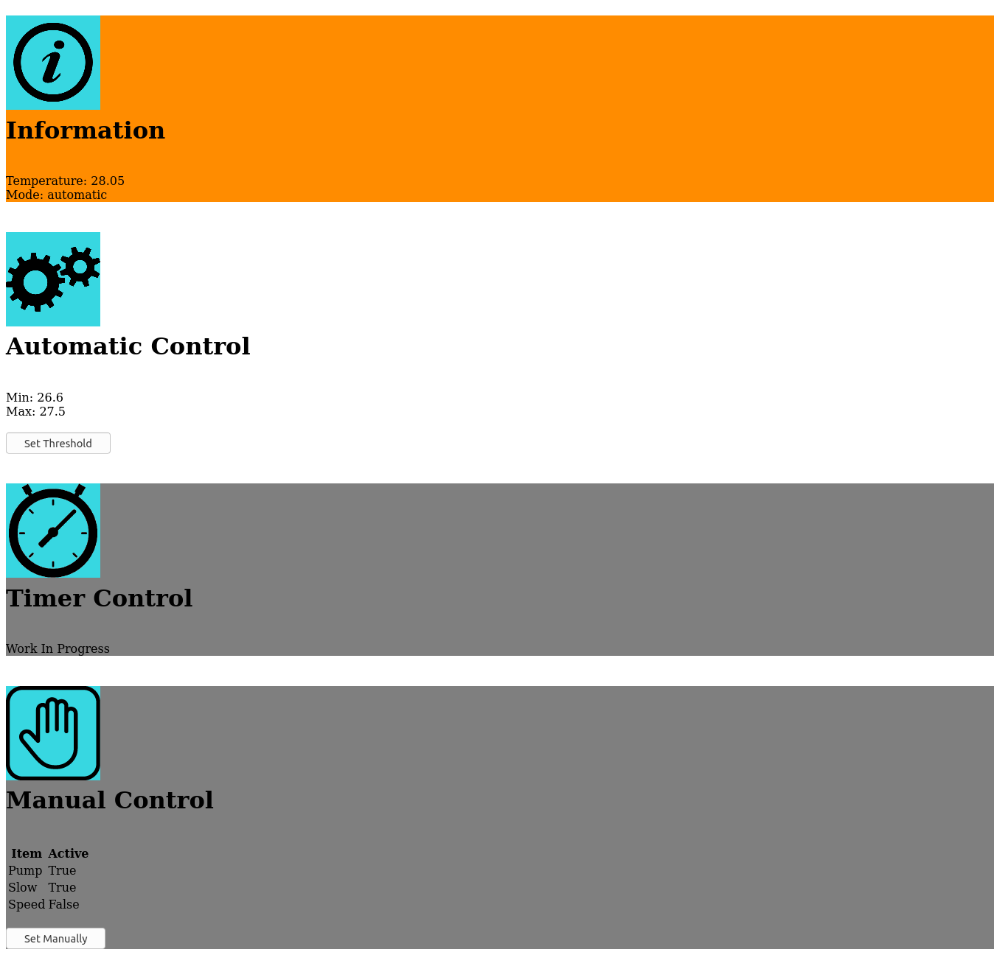

# cooler control with rpi

## Hardware Requirements:

1. RPI 2 or higher
2. GY-80 module
3. Some transistors and relays.

## Requirements:

`pip3 install requirements.txt`

## Run Project:

Clone the project on your rpi home. Then you can run it either manually:

`./run.sh`

Or put an entry in cron (using `crontab -e`):

`@reboot /home/pi/cooler_control/run.sh`

## Connect to the Server:

A flask server will show you the cooler status as bellow:

